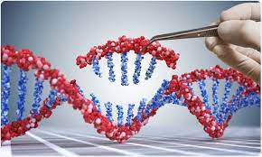

# Cancer_Gene_Mutations

  

# Problem Statement

A lot has been said during the past several years about how precision medicine and, more concretely, how genetic testing is going to disrupt the way diseases like cancer are treated.

Once sequenced, a cancer tumor can have thousands of genetic mutations. But the challenge is distinguishing the mutations that contribute to tumor growth (drivers) from the neutral mutations (passengers).

The challenge of this project is to categorize several gene variation in nine classes that represents the effect that this mutation will have in the correspondant protein function. Classes are as follow:
1. Likely loss-of-function
2. Likely Gain-of-function
3. Neutral
4. Loss-of-function
5. Likely Neutral
6. Inconclusive
7. Gain-of-function
8. Likely Switch-of-function
9. Switch-of-function

# Data

## 1. Original data

It consists of a dataframe get from Kaggle with the following information:
- ID: the id of the row used to link the mutation to the clinical evidence

- Gene: the gene where this genetic mutation is located

- Variation: the aminoacid change for this mutations

- TEXT: text based clinical literature

- Class: 1-9 the class this genetic mutation has been classified on. Classes are as follow:

## 2. Data Enrichment

Obtained from the variant nomenclature system (*Type* of mutation, and *Effect* on the protein), and the Cosmic Cancer Census Database (*GeneType, Chromosome,	Role,	TumourType* and	*Class* )

# Machine Learning

This is a Multiclass classification machine learning problem. It is defined by mostly categorial features, all of them except *Chromosome*. To face it, a One Hot Encoding has been applied to the variables and they have been stacked using *scipy*.

For the TEXT feature, it has been treated by removing the stopwords and getting just the words which are repeated at least three times.

Four models have been used to face this machine learning problem:
- Binomial Naïve-Bayes Classifier
- K-nearest neighbour 
- Logistic Regression
- Random Forest

Finally, feature engineering has been applied to the best models by removing features to reduce overfitting to the train dataset.

# Libraries # 

[pandas](https://pandas.pydata.org/docs/)

[seaborn](https://seaborn.pydata.org/)

[matplotlib.pyplot](https://matplotlib.org/stable/api/_as_gen/matplotlib.pyplot.html)

[sklearn](https://scikit-learn.org/stable/)

[pickle](https://docs.python.org/3/library/pickle.html)

[scipy](https://scipy.github.io/devdocs/index.html)

[numpy](https://numpy.org/doc/)

[re](https://docs.python.org/3/library/re.html)

# Bibliography
[Sequence variant nomenclature](http://varnomen.hgvs.org/recommendations/protein/variant/substitution/)

[Functional outcomes of genetic variants](https://www.ncbi.nlm.nih.gov/pmc/articles/PMC4628267/)

[Multiclass Classification](https://algorithmia.com/blog/multiclass-classification-in-machine-learning)

[Oncogenes](http://ongene.bioinfo-minzhao.org/ongene_human.txt)

[Cancer Gene Census](https://cancer.sanger.ac.uk/census)

[Naive Bayes](https://towardsdatascience.com/understanding-na%C3%AFve-bayes-algorithm-f9816f6f74c0)

[Laplace Smoothing](https://towardsdatascience.com/laplace-smoothing-in-na%C3%AFve-bayes-algorithm-9c237a8bdece)

[Calibrated Classification](https://machinelearningmastery.com/calibrated-classification-model-in-scikit-learn/)

[Logistic Regression ( SGDClassifier)](https://scikit-learn.org/stable/modules/generated/sklearn.linear_model.SGDClassifier.html)
